# データモデル

実装済み基盤と、後続フェーズのモデルを区別します。

```mermaid
erDiagram
  users ||--o{ user_consents : accepts
  users ||--o{ sessions : authenticates
  users ||--o{ password_resets : requests
  users ||--o{ email_verifications : verifies
  users ||--o| notification_preferences : configures
  users ||--o| line_accounts : links
  users ||--o{ line_oauth_flows : starts
  users ||--o| member_acquisitions : acquired_by
  users ||--o{ acquisition_campaigns : creates
  users ||--o{ entitlements : receives
  users ||--o{ subscriptions : contracts
  users ||--o{ day_passes : purchases
  users ||--o{ payment_transactions : pays
  users ||--o{ billing_checkouts : starts
  subscriptions ||--|| entitlements : grants
  day_passes ||--|| entitlements : grants
  subscriptions ||--o{ payment_transactions : records
  day_passes ||--o{ payment_transactions : records
  subscriptions ||--o{ billing_events : audits
  day_passes ||--o{ billing_events : audits
  users ||--o{ expert_assignments : assigned
  races ||--o{ expert_assignments : has
  race_days ||--o{ races : schedules
  races ||--o{ race_entries : contains
  races ||--o{ race_announcements : announces
  races ||--o| free_report_drafts : edits
  races ||--o{ free_report_versions : publishes
  free_report_versions ||--o| notification_events : queues
  race_announcements ||--o| notification_events : queues
  horses ||--o{ race_entries : enters
  race_entries ||--o| assessments : has_current
  assessments ||--o{ assessment_versions : appends
  races ||--o| predictions : drafts
  predictions ||--o{ prediction_versions : publishes
  prediction_versions ||--o{ prediction_marks : freezes
  prediction_versions ||--o{ prediction_bets : freezes
  prediction_versions ||--o| notification_events : queues
  users ||--o{ prediction_products : authors
  prediction_products ||--o{ prediction_product_races : contains
  races ||--o{ prediction_product_races : participates
  prediction_product_races ||--o{ prediction_product_selections : selects
  race_entries ||--o{ prediction_product_selections : references
  prediction_products ||--o{ prediction_product_previews : previews
  prediction_products ||--o{ prediction_product_versions : publishes
  prediction_product_versions ||--o| notification_events : queues
  prediction_products ||--o| win5_result_drafts : edits
  prediction_products ||--o{ win5_result_versions : confirms
  prediction_product_versions ||--o{ win5_result_versions : evaluates
  win5_result_versions ||--o| double_hit_results : contributes
  notification_events ||--o{ notification_deliveries : expands
  users ||--o{ notification_deliveries : receives
  notification_deliveries ||--o{ notification_attempts : records
  races ||--o| race_result_drafts : edits
  races ||--o{ race_result_versions : confirms
  race_result_versions ||--o{ prediction_performances : calculates
  prediction_versions ||--o{ prediction_performances : evaluates
  prediction_performances ||--o{ bet_performances : settles
  system_settings {
    string id PK
    int revision
    boolean predictionPublicationEnabled
    boolean csvImportEnabled
    boolean lineNotificationsEnabled
    boolean lineLoginEnabled
  }
```

usersはUUID、メールアドレスと外部authSubjectは一意。sessions/password_resetsはトークンのハッシュを一意化。entitlementsは有限期間・理由・付与者を必須にする。racesは開催日＋競馬場＋レース番号で一意。expert_assignmentsはレース＋ユーザーの複合キー。

audit_logsは操作者、ロール、対象、理由、差分、requestId、UTC時刻を保持する追記専用の独立テーブル。ユーザー削除に連動して履歴を消さないため、操作者への削除カスケードを持たない。

Phase 2第1区間でrace_days、horses、race_entries、import_batchesを追加。race_daysは開催日＋競馬場で一意。race_entriesはレース＋馬番、およびレース＋馬IDが一意で、斤量・オッズはDecimal。races.revisionは手動更新と取込確定時の競合検出に使用する。import_batchesは操作者、検証済み入力、元データのハッシュ、期限、確定時刻を保持する。

Phase 2第2区間でassessmentsとassessment_versionsを追加。assessmentsは出走馬ごとの最新内容とrevision、assessment_versionsは各保存時の内容・出走馬スナップショット・操作者・理由を保持する追記専用履歴。履歴には更新・削除・TRUNCATE拒否トリガーを適用する。

Phase 2第3区間でpredictions（可変下書き）、publication_previews（期限付き確認）、prediction_versions（公開版）、prediction_marks / prediction_bets（凍結子データ）、notification_events（送信前outbox）を追加。公開版は前版への自己参照で訂正チェーンを作る。公開版と子データは追記専用で、子データは公開版作成時のDBトランザクションIDと一致するINSERTだけを許可する。Phase 3Bで受信者単位のnotification_deliveriesと追記専用notification_attemptsを追加した。

Phase 3Dでline_accountsへ通知不可時刻と最終Webhook時刻を追加し、署名検証後のイベント識別子・種別・subjectハッシュ・処理結果だけをline_webhook_eventsへ追記する。Webhook本文とLINE subjectは履歴へ保存しない。

WIN5 Phase 4第1区間でnotification_eventsへ商品公開版の排他的な参照を追加した。初版・訂正版と通知イベントは同じDBトランザクションで作成し、商品公開版、受信者、チャネル、通知種別、版番号から配送を冪等化する。通知本文は商品メタデータだけから生成する。

Phase 3Eでline_accountsへ解除時刻を追加し、削除せず連携履歴を維持する。line_oauth_flowsは10分有効のstate/nonce/PKCE情報を保持し、stateとnonceはハッシュ、nonceとcode verifierは暗号文で保存する。purposeとuserIdの整合性はDB制約で強制する。

Phase 3Fでrace_result_drafts、追記専用race_result_versions、prediction_performances、bet_performancesを追加した。結果確定と公開版・買い目別精算は同一トランザクションでのみ作成でき、確定後の変更・削除・子データ後付けをDBで拒否する。

Phase 3Aでsystem_settingsを追加。singleton行に緊急停止、通知再試行方針、Messaging APIとLINE Loginの各設定、暗号化した秘密値、revision、更新者、更新時刻を保持する。不完全な資格情報でLINE通知またはLINE Loginを有効化できないようDB制約を持つ。

Phase 4Aでsubscriptions、day_passes、payment_transactions、billing_eventsを追加。契約と1日利用はそれぞれ有限期間entitlementを1件だけ持つ。有効な月額契約は会員ごとに1件、1日利用は会員・開催日ごとに1件。支払試行と請求イベントは追記専用で、DBトリガーが更新・削除・TRUNCATEを拒否する。system_settingsは価格、創設会員販売上限、猶予日数を保持する。

Phase 6Aでbilling_checkoutsとstripe_webhook_eventsを追加。Checkout作成時は申込内容とサーバー価格を固定し、署名付き完了イベントの照合後だけ契約とentitlementを作る。StripeイベントIDは一意で、受信履歴は追記専用とする。

Phase 6Bでは同じ追記専用Stripe受信履歴を使い、Invoice成功・失敗とSubscription更新・終了を既存のsubscriptions、entitlements、payment_transactions、billing_eventsへ同期する。Stripe Invoiceの期間を外部契約の正とし、失敗時は有限の猶予終了時刻までに権限を制限する。

Phase 6Cでsystem_settingsにStripeの暗号化Secret key、暗号化Webhook secret、動作モード、3つのPrice IDを追加した。秘密値は設定APIへ返さず、変更理由と設定状態だけを既存の監査ログへ残す。

Phase 6Dでfree_report_drafts、追記専用free_report_versions、固定1枠のfree_member_benefitsを追加した。無料速報は有料予想版から分離し、UP/DOWN各1頭と理由、音声URL、結果確定後の検証だけを会員へ返す。notification_eventsは予想版、対象レース告知、無料速報版のいずれか1件だけを参照する。

Phase 6Pでnotification_preferencesにメール全体の購読設定、notification_eventsにメール展開完了時刻、system_settingsにメール通知の全体停止設定を追加した。notification_deliveriesのchannelはLINEまたはEMAILで、同じevent・会員でもチャネルごとに独立した配送と試行履歴を持つ。

Phase 6Qでsystem_settingsに暗号化したResend API keyと送信元を追加した。秘密値は管理API、監査履歴、ログへ返さず、APIの取引メールとworkerの公開通知が同じ有効設定を参照する。

Phase 5Aでusers.emailをLINE登録時に限りnullableとし、emailVerifiedAtとregistrationMethodを追加した。email_verificationsは登録確認または予備メール確認のハッシュ済み使い切りtoken、期限、確認予定メール、予備パスワードハッシュを保持する。line_registration_grantsはLINE OAuthから会員作成までの15分だけsubjectの暗号文とハッシュを保持する。

Phase 5Bでrace_announcementsを追加した。レースごとの版番号、公開者、運用理由、公開時刻を追記専用で保持し、notification_eventsは予想公開版または対象レース告知のどちらか一方を参照するDB制約を持つ。

Phase 5Dでmember_notification_readsを追加した。会員と通知イベントの複合主キー、既読時刻だけを保持し、公開イベントやLINE配送履歴を変更せずWeb上の既読状態を管理する。

Phase 6Gでmember_acquisitionsを追加した。会員ごとに初回流入を1件だけ保持し、source、medium、campaign、content、term、登録画面パス、紹介コードを保存する。更新・削除・TRUNCATEはDBトリガーで拒否する。LINE登録ではline_oauth_flowsから15分有効のline_registration_grantsへ流入JSONをサーバー内で引き継ぎ、会員作成時に再検証して固定する。

Phase 6Hでacquisition_campaignsを追加した。管理用名称、一意コード、UTMのsource・medium・content、登録先パス、任意の紹介コード、作成者とUTC作成時刻を保存する。登録URLはAPIがAPP_BASE_URLから生成し、作成操作は監査ログへ追記する。

Phase 6Yでsystem_settingsにメール登録Bot対策の有効状態、Turnstile Site key、暗号化Secret keyを追加した。有効時に両資格情報を必須とするDB制約を持ち、Secret keyは管理API、公開設定、監査、ログへ返さない。CAPTCHA tokenとCloudflare応答本文は保存しない。

Phase 6ZでusersにSupabaseの予備TOTP factor IDと、15分有効の登録途中factor ID・用途・期限を追加した。主・予備・登録途中のfactor IDには一意索引を持たせ、主と予備が同じIDになること、および登録途中3項目の部分保存をDB制約で拒否する。TOTP secretは自社DBへ保存しない。

Phase 7Aでoperational_alert_settings、operational_alerts、operational_alert_deliveriesを追加した。設定はsingletonで有効状態、最低重大度、運営メール通知先、revisionを保持する。アラートは異常元の一意キー、重大度、安全な要約、未確認・確認済み・解決済みの各記録を保持する。外部配送はアラートと通知先の組を一意にし、lease、再試行回数、結果だけを保存する。会員ID、会員メール、LINE subject、予想本文は保持しない。

Phase 7B第1区間でbilling_support_requestsとbilling_support_eventsを追加した。問い合わせは会員と任意の本人所有支払に紐づき、分類、本文、現在状態を保持する。返金・領収書分類では対象支払をDB制約でも必須にする。問い合わせ本体は削除禁止、状態変更eventは追記専用とし、管理者の対応理由と監査履歴を残す。

WIN5 Phase 2で`prediction_products`、`prediction_product_races`、`prediction_product_selections`、`prediction_product_previews`、`prediction_product_versions`を物理追加した。既存の`predictions`系は1レース単位のパドック直前予想として残し、WIN5データを混在させない。

`prediction_products`は`type + targetDate`を一意にし、当面のtypeは`WIN5_PREVIEW`。`prediction_product_races`は商品内の`legNumber` 1〜5と`raceId`をそれぞれ一意にし、既存レースを順序付きで5件参照する。`prediction_product_selections`は既存出走馬を参照し、対象レースごとの中心馬を1頭に制限する。

`prediction_product_versions`は公開内容全体を凍結した追記専用スナップショットで、商品内版番号と直前版を保持する。WIN5 Phase 4第2区間で`win5_result_drafts`、`win5_result_versions`、`win5_result_legs`を物理追加した。確定版は最終の商品公開版と5件の最新確定レース結果版を固定し、通常馬券の`prediction_performances`へ混在させない。結果版と5脚は同一トランザクションでのみ作成でき、件数・的中数・想定払戻・回収率を遅延制約で照合した上でUPDATE、DELETE、TRUNCATEを拒否する。`double_hit_results`は引き続き後続区間の論理モデルである。

`notification_events`はPhase 4で既存3種類の公開元にWIN5公開版を加え、常にいずれか1種類だけを参照するXOR制約へ移行した。Phase 2で追加したWIN5公開版とPhase 4第2区間のWIN5確定結果版はDBトリガーで保護する。結果通知参照とダブル的中判定は後続区間で追加する。

次区間候補はStripeの返金・領収書導線、プラン変更、または課金状態の会員向け通知。実Supabase・メール・LINE・Stripe資格情報を使うステージング接続、正式価格、返金、クーポン、試用、CMSは未確定・未実施。
